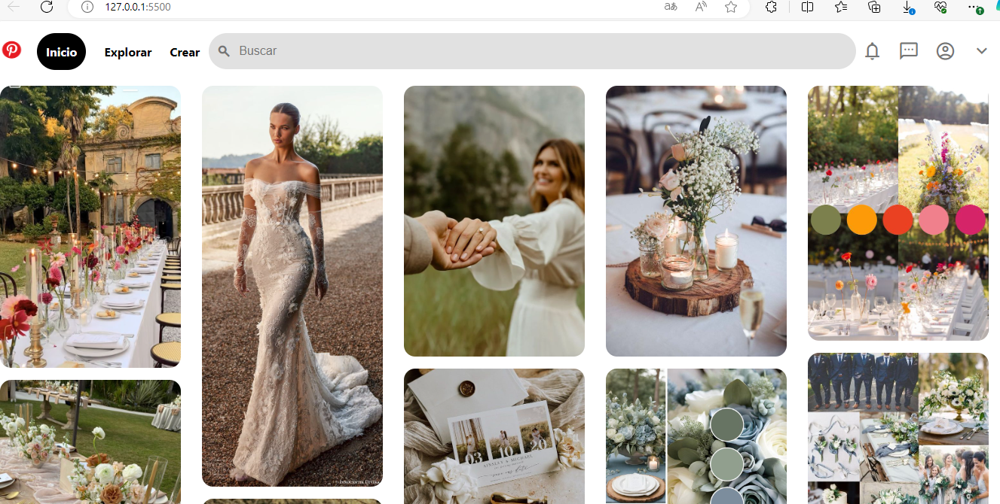

# Clon de Pinterest con HTML y CSS 
El presente proyecto es un clon de la interfaz de usario de Pinterest, creado puramente con HTMLS y CCS en el curso de Tecnolochicas creado por una servidora.

Se enfoca en replicar la apariencia visual de Pinterest, ofreciendo una experiencia de navegacion similar con un diseño responsive y funcionalidades básicas.

### Características

* **Diseño Responsive:** Adaptable a diferentes tamaños de pantalla para una experiencia de usario óptima en dispositivos moviles y de escritorio.
  
* **Interfaz de Usuario Intuitivo:** Insportada en Pinterest, con una navegación fácil y accesible.

* **Interacciones Dinámicas:** Efectos visuales para elementos interactivos como botones y enlaces.

* **Iconogracía y Estilos Modernos:** Uso de la biblioteca de Iconos de Material Design y estilos CSS para una apaciencia cool.

### Tecnologias Utilizadas

+ **HTML5:** Para la estructura básica del sitio.
+ **CSS3:** Para el diseño y estilo, incluyendo _flexbox_ para un diseño responsivo y efectos visuales.
+ **Google Fonts:** Para fuentes personalizadas.

### Vista Previa del Proyecto 

### Contacto

Si te gustaria invitarme a colaborar en un proyecto, contáctame por [Linkedin](https://www.linkedin.com/in/karla-navarro-3993a8123/).

 # Encabezado 1
 ## Encabezado 2
 ### Encabezado 3
 *Listado
 **Negritas**
 Emojis :  icono windows + punto al mismo tiempo
